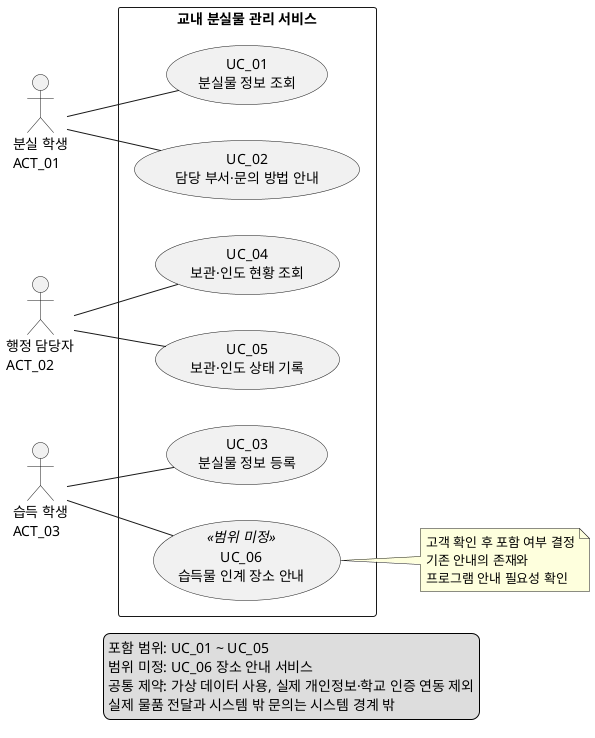

# 교내 분실물 관리 서비스 유스케이스 식별서

| 항목 | 내용 |
|---|---|
| 버전 | 0.1 |
| 분석 근거 | [고객 요구사항.md](고객%20요구사항.md), [SRS_v0.1.md](SRS_v0.1.md) |
| 목적 | 사용자가 무엇을 왜 하려는지에 따라 요청부터 결과 제공까지 완료되는 서비스 단위로 식별한다. |
| 시스템 경계 | 교내 분실물 관리 서비스. 물품 정보 조회·등록·상태 기록·문의 방법 안내를 포함한다. 실제 물품 전달과 시스템 밖의 전화·방문 문의는 경계 밖이다. |
| ID 규칙 | 액터 ACT_01, 유스케이스 UC_01, 질문 Q_01부터 각 분류별로 순차 부여한다. |
| 상태 | 포함: 요구사항에서 제공 범위로 정해짐. 범위 미정: 고객 확인 후 포함 여부 결정. 포함 항목도 상세 절차·권한이 확정되었다는 뜻은 아니다. |

## 1. 식별 기준 및 검토 반영

유스케이스 하나는 액터의 요청부터 의미 있는 결과 제공까지 완료되는 하나의 서비스 단위로 식별한다. 서비스 안에서 수행하는 검색 조건 입력, 보관 여부·위치 표시, 입력 검증, 저장은 별도 유스케이스로 분리하지 않는다. 조회 서비스와 상태 기록 서비스는 각각 정보 제공과 업무 결과 반영이라는 독립적인 결과가 있어 구분한다.

이번 검토에 따라 **분실물 정보 등록 서비스의 주 액터는 습득 학생**으로 변경한다. 습득 학생은 확정 액터이며, 장소 안내 서비스의 범위만 미정이다. 행정 담당자의 등록 참여 여부는 추가 확인 전까지 부여하지 않는다. 로그인 방식, 등록 승인 절차, 등록 즉시 공개 여부도 임의로 확정하지 않는다.

| 검토 항목 | 반영 내용 |
|---|---|
| 서비스 단위 식별 | 각 UC를 조회·안내·등록·현황 조회·상태 기록 서비스로 명명하고 요청과 완료 결과를 기술한다. |
| 등록 주체 변경 | UC_03의 주 액터를 ACT_03 습득 학생으로 변경한다. 액터 목록·다이어그램·질문 사항을 함께 수정한다. |
| 최초 분석 근거 | 고객 요구사항 1장은 행정 담당자의 등록을 목표로 제시하고, 2장 역할 표는 행정 담당자가 물품을 등록한다고 명시한다. S2의 등록 시간 부족 발언과 NEEDS_2의 “행정 담당자는 필요한 물품 정보를 등록할 수 있어야 한다”도 같은 해석을 뒷받침한다. SRS FR_04 역시 행정 담당자로 명시되어 있다. |
| 최신 기준과 원문 차이 | 이번 사용자 검토를 UC_03의 최신 기준으로 적용한다. 고객 요구사항 NEEDS_2, SRS FR_04·Pol_06 및 RTM의 등록 주체 표기는 기존 기준이므로 후속 동기화 대상이다. 해당 원문이 이미 습득 학생을 명시하는 것으로 인용하지 않는다. |
| 효율 목표의 영향 | 기존 NFR_01은 행정 담당자의 등록 시간 기준이다. 이를 습득 학생에게 자동 적용하지 않는다. 학생 등록 시간과 행정 담당자 부담 감소를 어떻게 평가할지는 Q_11에서 확인한다. |

## 2. 액터 목록

액터는 시스템과 직접 상호작용하는 역할이다. 한 사람이 분실 학생과 습득 학생 역할을 모두 수행할 수 있다.

| 액터 ID | 액터 | 무엇을 하려는가 | 왜 하려는가 | 연결 유스케이스 | 상태·근거 |
|---|---|---|---|---|---|
| ACT_01 | 분실 학생 | 물품의 보관 여부·위치와 담당 부서의 문의 방법을 확인한다. | 불필요한 행정실 방문을 줄이고 물품을 찾기 위한 방문·문의 판단을 하기 위해서다. | UC_01, UC_02 | 포함; S1, NEEDS_1, NEEDS_4, FR_01~FR_03, FR_07 |
| ACT_02 | 행정 담당자 | 보관·인도 현황을 조회하고 상태를 기록한다. | 실제 보관·인도 결과를 관리하고 문의에 대응하기 위해서다. | UC_04, UC_05 | 포함; NEEDS_3, FR_05, FR_06. 등록 참여 여부와 세부 권한 미정 |
| ACT_03 | 습득 학생 | 주운 물품의 정보를 등록하고, 장소 안내 제공 시 인계 장소를 확인한다. | 분실 학생이 물품을 찾도록 돕고 적절한 장소에 맡기기 위해서다. | UC_03, UC_06 | 등록 액터 확정: 최신 사용자 검토. 장소 안내만 범위 미정: NEEDS_5, FR_08 |

### 직접 액터로 식별하지 않은 이해관계자

| 이해관계자 | 확인된 역할 | 현재 액터로 두지 않은 이유 |
|---|---|---|
| 정보보호 담당자 | 공개 정보 범위를 검토한다. | 시스템에서 공개 항목을 직접 설정·승인한다는 요구는 없다. 검토 역할만으로 관리 기능을 추가하지 않는다. |
| 학생회 | 학생의 불편과 개선 의견을 전달한다. | 시스템을 통한 의견 등록·처리 요구는 없다. |
| 서비스 운영 책임자 | 운영 정책과 책임을 결정한다. | 시스템 내 정책 관리 기능은 명시되지 않았으며 실제 담당자도 미정이다. |
| 보관 담당 부서 | 학생의 문의 대상이다. | 부서 정보를 안내하는 요구만 있다. 시스템에서 문의를 수신·답변하는 액터로 확정하지 않는다. |

## 3. 유스케이스 목록

| UC ID | 서비스명 | 주 액터 | 사용자 목표: 무엇을 왜 하려는가 | 서비스 요청 → 완료 결과 | 관련 근거 | 상태·질문 |
|---|---|---|---|---|---|---|
| UC_01 | 분실물 정보 조회 | ACT_01 분실 학생 | 잃어버린 물품이 보관되어 있는지와 위치를 알아내어 방문 필요성과 방문 장소를 판단하려 한다. | 물품 정보 조회 요청 → 조회 대상의 보관 여부와 공개 가능한 위치 제공. 검색·상태·위치 확인을 한 서비스 안에 포함한다. | NEEDS_1; FR_01~FR_03; NFR_02, NFR_05; Pol_03, Pol_07 | 포함·검색 조건과 공개 범위 미정; Q_01~Q_03, Q_12 |
| UC_02 | 담당 부서·문의 방법 안내 | ACT_01 분실 학생 | 물품을 찾기 위한 추가 확인을 위해 문의할 부서와 방법을 알아내려 한다. | 문의 안내 요청 → 담당 부서와 허용된 문의 방법 제공. 실제 문의 접수·답변은 포함하지 않는다. | NEEDS_4, NEEDS_6; FR_07; NFR_02; Pol_02, Pol_08 | 포함·안내 내용과 접근 경로 미정; Q_02, Q_08 |
| UC_03 | 분실물 정보 등록 | ACT_03 습득 학생 | 주운 물품의 정보를 등록하여 분실 학생이 자신의 물품을 찾을 수 있도록 하려 한다. | 물품 정보 입력·등록 요청 → 입력 기준에 따른 정보 저장 및 등록 결과 제공. 입력 검증과 저장은 서비스 내부 처리다. 공개 시점과 보관 상태 확정 시점은 미정이다. | 최신 사용자 검토; 기존 NEEDS_2·FR_04는 등록 기능의 근거이나 주체 변경 반영 필요; Pol_04, Pol_06 | 등록 주체 확정·입력 항목과 등록 후 처리 미정; Q_04~Q_06, Q_11 |
| UC_04 | 보관·인도 현황 조회 | ACT_02 행정 담당자 | 보관 중인 물품과 이미 인도한 물품을 구분하여 관리와 문의 대응에 필요한 현황을 파악하려 한다. | 현황 조회 요청 → 대상 물품의 보관·인도 상태 제공. 별도 통계·대시보드는 확정하지 않는다. | NEEDS_3; FR_06; Pol_05, Pol_06 | 포함·표시 방식과 권한 미정; Q_05, Q_07 |
| UC_05 | 보관·인도 상태 기록 | ACT_02 행정 담당자 | 실제 보관·인도 결과를 반영하여 물품의 현재 처리 상태를 관리하려 한다. | 대상 물품의 상태 기록 요청 → 허용된 조건에 따른 상태 저장 및 처리 결과 제공. 대상 확인·저장·결과 확인은 한 서비스 내부에서 수행한다. | NEEDS_3; FR_05, FR_06; Pol_05~Pol_07 | 포함·처리 조건과 정정 방법 미정; Q_03, Q_05, Q_06 |
| UC_06 | 습득물 인계 장소 안내 | ACT_03 습득 학생 | 주운 물품을 적절한 장소에 맡기기 위해 인계 장소를 알아내려 한다. | 장소 안내 요청 → 물품을 맡길 장소 제공. 접수 신청·인계 예약은 포함하지 않는다. | NEEDS_5; FR_08; Pol_09 | 범위 미정; Q_09 |

UC_01의 조회 결과는 소유권 확인이나 수령 승인이 아니다. 조회 결과가 없다는 사실만으로 실제 미보관을 단정하지 않는다. UC_03에서 정보를 등록했다는 사실만으로 행정실에 물품이 인계되었거나 보관 중이라고 처리하지 않는다. 관련 조건은 Q_06의 확인 대상이다.

## 4. 유스케이스 다이어그램 — PlantUML

ACT_03은 UC_03의 확정 액터이며, UC_06에만 범위 미정을 표시한다. 액터 연결선은 참여 관계이며 실행 순서를 뜻하지 않는다. 원문에서 필수 호출이나 선택적 확장 관계가 확정되지 않았으므로 `include`·`extend` 관계를 임의로 추가하지 않는다.

## 5. 질문 사항

아래 항목은 미결정 사항이다. 확인 대상은 질문을 전달할 역할 제안이며, 최종 결정 권한을 임의로 부여한 것이 아니다.

| 질문 ID | 고객에게 확인할 질문 | 질문 이유·결정에 미치는 영향 | 관련 UC·근거 | 확인 대상 제안 |
|---|---|---|---|---|
| Q_01 | [논의] 학생은 어떤 정보로 물품을 찾아야 하나요? 필요한 검색 조건과 일치 기준은 무엇이며, 조회 결과가 없을 때 어떤 안내가 필요한가요? | UC_01의 조회 과정과 결과 없음 처리 범위를 결정한다. 미등록·검색 불일치와 실제 미보관을 혼동하지 않도록 한다. | UC_01; SC1, FR_01 | 분실 학생, 행정 담당자 |
| Q_02 | [논의] 학생에게 공개할 물품 정보와 보관 위치의 상세 수준은 어디까지인가요? 공개 항목의 최종 결정자는 누구인가요? | 개인 번호 비공개 원칙을 유지하면서 조회·안내에 사용할 정보를 결정한다. | UC_01, UC_02; NEEDS_6, NFR_02, Pol_02, Pol_03 | 정보보호 담당자, 운영 책임자 |
| Q_03 | [논의] 인도 완료 물품도 학생이 조회할 수 있어야 하나요? 표시한다면 상태와 위치를 어떻게 안내해야 하나요? | 완료 물품의 노출과 UC_05 이후 학생 조회 결과를 결정한다. | UC_01, UC_05; FR_02, Pol_07 | 분실 학생, 행정 담당자, 정보보호 담당자 |
| Q_04 | [논의] 습득 학생이 등록할 필수·선택 항목은 무엇인가요? 보관 위치와 담당 부서도 학생이 입력하나요? | 학생이 알 수 있는 정보와 행정 담당자가 확인할 정보를 구분하고 입력 기준을 결정한다. | UC_03; 최신 검토, FR_04 변경 대상, Pol_04 | 습득 학생, 행정 담당자 |
| Q_05 | [논의] 습득 학생의 등록 권한을 어떻게 확인하나요? 행정 담당자도 등록할 수 있어야 하나요? 조회·상태 변경·정정 권한은 어떻게 구분하나요? | 학생 등록은 확정 사항이다. 행정 담당자의 추가 등록 권한과 역할 확인 방식을 결정한다. 학교 인증 연동 제외는 유지한다. | UC_01~UC_05; 최신 검토, NFR_04, Pol_06 변경 대상 | 습득 학생, 행정 담당자, 운영 책임자 |
| Q_06 | [논의] 학생은 물품을 맡기기 전과 후 중 언제 등록하나요? 등록 후 바로 공개하나요, 담당자의 보관 확인이 필요한가요? 초기 상태·인도 완료 조건·잘못 기록한 상태의 정정 절차는 무엇인가요? | 등록 사실과 실제 보관을 구분한다. 승인 단계나 새로운 상태를 임의로 추가하지 않고 등록·보관·인도 관계를 결정한다. | UC_03, UC_05; FR_05, Pol_01, Pol_05, Pol_06 | 습득 학생, 행정 담당자, 운영 책임자 |
| Q_07 | [논의] 담당자가 보관 중·인도 완료를 구분할 때 필요한 표시 방식은 무엇인가요? 상태 표시만으로 충분한가요, 상태별 조회가 필요한가요? | UC_04의 현황 확인 범위를 결정한다. 필터나 통계를 임의로 추가하지 않는다. | UC_04; FR_06 | 행정 담당자 |
| Q_08 | [논의] 안내할 담당 부서·문의 수단·문구는 무엇인가요? 문의 안내는 개별 물품에 연결되나요, 공통 안내인가요? 물품 조회 결과가 없어도 안내에 접근해야 하나요? | UC_02의 안내 내용과 UC_01과의 접근 관계를 결정한다. | UC_02; FR_07, Pol_08 | 분실 학생, 행정 담당자, 운영 책임자 |
| Q_09 | [논의] 습득물을 맡길 장소에 대한 기존 안내가 있나요? 이번 프로그램에도 안내가 필요한가요? 필요하다면 어떤 장소와 내용을 제공해야 하나요? | UC_06 장소 안내 서비스의 포함 여부를 결정한다. ACT_03의 등록 참여는 확정 사항이다. | UC_06; SC4, FR_08, Pol_09 | 습득 학생, 행정 담당자, 운영 책임자 |
| Q_10 | [논의] 서비스 운영 정책과 책임을 결정할 실제 조직 또는 담당자는 누구인가요? | 미정 사항의 결정 창구를 확인한다. 관리 화면이나 추가 액터를 자동으로 도출하지 않는다. | 전체; Pol_12, 고객 요구사항 2장 | 학교 측 운영 담당자 |
| Q_11 | [논의] 등록 주체가 습득 학생일 때 등록 편의성을 어떻게 평가하나요? 기존 NFR_01의 중앙값 60초·사용자 5명·각 10건 조건을 학생에게 적용할까요? 행정 담당자의 업무 부담 감소는 무엇으로 측정하나요? | 기존 담당자 대상 등록 시간 목표를 학생에게 자동 적용하지 않는다. 학생의 등록 효율과 담당자의 업무 부담을 구분해 기준을 결정한다. | UC_03; NEEDS_7, NFR_01 재검토, Pol_13 | 습득 학생, 행정 담당자, 운영 책임자 |
| Q_12 | [논의] 예상 물품 수·동시 사용자 수·이용 환경은 어떠한가요? 물품 1,000건·동시 사용자 20명에서 조회 응답 p95 2초 이하라는 제안과 SRS의 시험 조건이 적절한가요? | UC_01의 성능 목표·부하 조건을 확정한다. | UC_01; NFR_05 | 운영 책임자, 실제 서비스 환경 담당자 |
| Q_13 | [논의] 조회·안내 실패 시 재시도와 취소를 어떻게 제공하나요? 이전 결과·조회 조건·등록 입력은 화면 이탈이나 재접속 시에도 보존해야 하나요? 보존한다면 범위와 기간은 무엇인가요? | 오류를 빈 조회 결과와 구분하고 재시도·취소 및 임시 입력 보존 기준을 결정한다. | UC_01~UC_04, UC_06; 상세 흐름의 추가 제안 | 분실 학생, 습득 학생, 행정 담당자, 운영 책임자 |
| Q_14 | [논의] 등록의 반복 제출과 실제로 유사한 물품을 어떤 기준으로 구분하나요? 저장 결과를 받지 못했을 때 어떻게 결과를 확인하고 재등록을 방지하나요? | 중복 판정·저장 실패·결과 미확인 상황과 기록 보존 기준을 결정한다. 자동 병합이나 기존 물품 덮어쓰기는 미확정이다. | UC_03; 상세 흐름 A3, E1, E2, C1 | 습득 학생, 행정 담당자, 운영 책임자 |
| Q_15 | [논의] 여러 담당자가 같은 물품을 변경하거나 같은 상태를 반복 제출하면 어떻게 처리하나요? 저장 결과가 불명확할 때 확인 방법과 저장 전후 취소·정정 기준은 무엇인가요? | 충돌 시 최신 정보 보존, 무변경 종료, 실패·결과 미확인 및 정정 처리 기준을 결정한다. | UC_05; 상세 흐름 A1, A3, A4, E1, E2, C1 | 행정 담당자, 운영 책임자 |
| Q_16 | [논의] 문의 정보나 인계 장소가 누락되었거나 사용할 수 없을 때 어떤 안내를 제공하나요? 안내 내용을 확인·정비할 책임자는 누구인가요? | 불완전 안내를 정상 성공과 구분하고 대체 안내와 운영 책임을 결정한다. 별도 관리 화면은 자동 추가하지 않는다. | UC_02, UC_06; Pol_08, Pol_09, Pol_12 | 행정 담당자, 운영 책임자 |

## 6. 공통 제약과 범위 적용

| 항목 | 유스케이스에 적용하는 내용 | 근거 |
|---|---|---|
| 공개 정보 제한 | UC_01, UC_02는 결정된 공개 범위를 따르며 개인 휴대전화 번호를 공개하지 않는다. NEEDS_6은 독립적인 학생 목표보다 해당 UC의 제약으로 반영한다. | NEEDS_6, NFR_02, Pol_02, Pol_03 |
| 등록 부담 감소 | 학생의 등록 편의성과 행정 담당자의 부담 감소를 구분한다. 기존 NFR_01은 담당자 대상 제안이므로 학생 등록 서비스에 그대로 확정 적용하지 않는다. Q_11에서 대상·지표·목표를 확인한다. | NEEDS_7, NFR_01 재검토, Pol_13 |
| 조회 성능 | UC_01에 적용한다. SRS의 p95 2초 목표와 부하 조건은 제안 상태이며 독립 유스케이스로 만들지 않는다. | NFR_05 |
| 데이터·인증 | 모든 UC는 가상 데이터 사용, 실제 개인정보 사용 제외, 학교 인증 연동 제외 제약을 따른다. | C_1, NFR_03, NFR_04, Pol_01 |
| 사진 매칭·알림 | 사진 기반 유사 물품 조회·자동 매칭과 매칭 결과 자동 알림은 이번 UC 목록에서 제외한다. | SC5, SC7, Pol_10, Pol_11 |
| 확인 전 미추가 | 물품 정보 수정·삭제, 상태 정정 전용 UC, 수령 신청·예약, 온라인 문의 접수, 정책 설정 화면은 현재 목록에서 확정하지 않는다. 상태 정정 요구는 Q_06 답변 후 기존 UC에 포함할지 별도 UC로 식별할지 결정한다. | FR_04, FR_05, FR_07의 현재 범위 및 미정 사항 |

## 7. Use Case Description

각 표는 하나의 서비스 단위를 상세화한다. 기본 흐름의 B1, B2 등과 대안·예외 흐름의 A1, E1, C1 등은 **해당 UC 안에서만 유효한 단계 ID**다. A는 대안, E는 오류·예외, C는 취소를 뜻한다. 대안·예외 흐름은 **분기 지점 → 조건 → 대응 → 복귀 또는 종료** 순서로 기술한다.

**[논의]**는 원문 또는 최신 사용자 검토에서 확정되지 않은 처리 제안·질문을 뜻한다. 태그가 붙은 동작과 보존 기준은 고객 합의 전 구현 의무로 확정하지 않는다. 기본 흐름은 합의할 정책이 충족된 정상 상황의 초안이며, 별도 승인 기능·로그인 방식·새 물품 상태를 묵시적으로 추가하지 않는다. 실제 개인정보 사용과 학교 인증 연동 제외 등 확정된 공통 제약은 계속 적용한다.

| 추가 기술 항목 | 추가 이유 |
|---|---|
| 범위·상태 | 포함된 서비스와 범위 미정인 UC_06을 구분한다. |
| 관련 기능·비기능 요구사항 및 경계 | 요구사항 추적과 서비스 종료 범위를 명확히 한다. |
| 단계·분기 ID | 검토자가 어느 기본 단계에서 분기하고 어디로 돌아가는지 확인할 수 있게 한다. |
| 저장 결과 미확인 종료 | 저장 실패와 응답 실패를 구분하여 중복 등록·상태 덮어쓰기를 논의할 수 있게 한다. |

### 7.1. UC_01 — 분실물 정보 조회

| 항목 | 내용 |
|---|---|
| ID / 이름 | UC_01 / 분실물 정보 조회 |
| 범위·상태 | 포함. 상세 처리 정책과 [논의] 표시는 합의 필요. |
| 사용자와 목표 | ACT_01 분실 학생이 등록된 물품의 보관 여부와 위치를 확인하여 방문 필요성과 방문 장소를 판단한다. |
| 관련 고객 요구·정책 ID | NEEDS_1, NEEDS_6; Pol_01, Pol_02, Pol_03, Pol_07 |
| 관련 기능·비기능 요구사항 및 경계 | FR_01~FR_03, NFR_02~NFR_05. [논의] NFR_05의 p95 2초와 부하 조건은 제안값이다(Q_12). |
| 사전조건 | 조회 서비스를 이용할 수 있다. [논의] 조회 접근 조건과 공개 항목이 정해져 있어야 한다(Q_02, Q_05). 조회 대상 물품의 존재 자체는 사전조건이 아니다. |
| 시작 사건 | 학생이 분실물 정보 조회를 요청한다. |
| 기본 흐름 | B1. 학생이 조회를 요청한다. [논의] 검색 조건을 사용하는 경우 합의된 조건을 입력한다(Q_01). B2. 시스템이 허용된 조회 범위에서 조건에 해당하는 등록 정보를 찾는다. B3. 시스템이 공개 가능한 물품 정보, 보관 여부 및 보관 중 물품의 위치를 제공한다. [논의] 인도 완료 물품 노출 방식은 Q_03에 따른다. B4. 학생이 결과를 확인하고 방문 여부와 장소를 판단하면 서비스가 종료된다. |
| 대안·예외 흐름 | A1 [논의] B2 → 일치하는 등록 정보가 없음 → ‘조회 결과 없음’을 안내하되 실제 미보관이라고 단정하지 않음 → 조건을 바꾸면 B1로 복귀, 아니면 종료(Q_01). |
| 대안·예외 흐름 | A2 [논의] B1 → 검색 조건을 제공하고 입력이 허용 기준에 맞지 않음 → 수정할 조건을 안내 → B1로 복귀(Q_01). |
| 대안·예외 흐름 | A3 [논의] B3 → 대상 물품이 인도 완료임 → 합의된 공개 정책에 따라 완료 상태로 표시하거나 결과에서 제외하며 보관 중으로 표시하지 않음 → B4로 복귀; 제외 후 결과가 없으면 A1(Q_03). |
| 대안·예외 흐름 | E1 [논의] B2~B3 → 조회 오류 또는 응답 시간 초과 → 결과 없음과 구분해 조회 실패를 안내 → 재시도 선택 시 B1, 포기 시 종료(Q_13). |
| 대안·예외 흐름 | C1 [논의] B1~B3 → 학생이 조회를 중단함 → 결과 제공을 중단 → 취소 종료(Q_13). |
| 사후조건 — 성공 | 학생이 공개 가능한 보관 여부와 위치를 확인한다. 조회는 물품 등록 정보나 상태를 변경하지 않는다. A1은 ‘결과 없음’으로 종료되며 물품 발견 성공을 의미하지 않는다. |
| 사후조건 — 실패·취소 및 보존 | 실패·취소 시 물품 정보와 보관·인도 상태는 그대로 보존된다. [논의] 검색 조건과 이전 결과를 화면에 유지할지, 재접속 시 복원할지는 Q_13에서 정한다. 실패 응답을 실제 미보관으로 해석하지 않는다. |
| 미확정 사항·고객 질문 | [논의] Q_01 검색·결과 없음 안내, Q_02 공개 범위, Q_03 완료 물품 노출, Q_05 접근 조건, Q_12 성능, Q_13 오류·취소 시 화면 보존. |

### 7.2. UC_02 — 담당 부서·문의 방법 안내

| 항목 | 내용 |
|---|---|
| ID / 이름 | UC_02 / 담당 부서·문의 방법 안내 |
| 범위·상태 | 포함. 상세 처리 정책과 [논의] 표시는 합의 필요. |
| 사용자와 목표 | ACT_01 분실 학생이 담당 부서와 문의 방법을 확인하여 물품을 찾기 위한 추가 문의를 어디로 할지 판단한다. |
| 관련 고객 요구·정책 ID | NEEDS_4, NEEDS_6; Pol_01, Pol_02, Pol_03, Pol_08 |
| 관련 기능·비기능 요구사항 및 경계 | FR_07, NFR_02~NFR_04. 실제 전화·방문 문의, 온라인 문의 접수·답변은 이 서비스 밖이다. |
| 사전조건 | 문의 안내 서비스를 이용할 수 있다. [논의] 안내할 담당 부서와 공개 가능한 문의 방법이 정해져 있어야 한다(Q_08). UC_01 완료를 필수 사전조건으로 두지 않는다. |
| 시작 사건 | 학생이 담당 부서·문의 방법 안내를 요청한다. |
| 기본 흐름 | B1. 학생이 문의 안내를 요청한다. [논의] 개별 물품 기준인지 공통 안내인지는 Q_08에서 결정한다. B2. 시스템이 해당 맥락의 담당 부서와 공개 가능한 문의 정보를 조회한다. B3. 시스템이 담당 부서와 문의 방법을 표시한다. 개인 휴대전화 번호는 표시하지 않는다. B4. 학생이 문의할 곳과 방법을 확인하면 안내 서비스가 종료된다. |
| 대안·예외 흐름 | A1 [논의] B1~B2 → 연결할 물품이 없거나 물품 조회 결과가 없음 → 공통 문의 안내를 제공할지 결정하며, 채택 시 공통 정보를 조회 → B3로 복귀; 공통 안내를 채택하지 않으면 안내 불가로 종료(Q_08). |
| 대안·예외 흐름 | A2 [논의] B2 → 담당 부서 또는 공개 가능한 문의 정보가 누락됨 → 확인 가능한 항목과 누락 사실을 알리고 개인 번호로 대체하지 않음 → 불완전 안내로 종료(Q_08, Q_16). |
| 대안·예외 흐름 | E1 [논의] B2~B3 → 안내 정보 조회 실패 → 실패를 알림 → 재시도 시 B1, 포기 시 종료(Q_13). |
| 대안·예외 흐름 | C1 [논의] B1~B3 → 학생이 안내를 닫음 → 안내 제공을 중단 → 취소 종료(Q_13). |
| 사후조건 — 성공 | 담당 부서와 허용된 문의 방법을 확인한다. 문의가 접수되거나 답변이 제공된 것은 아니다. 물품·부서 정보는 변경하지 않는다. |
| 사후조건 — 실패·취소 및 보존 | 실패·취소 시 기존 물품 및 안내 정보를 변경하지 않는다. A2의 일부 정보 표시는 완전한 안내 성공으로 간주하지 않는다. [논의] 이전 안내 화면 유지 여부는 Q_13에서 결정한다. |
| 미확정 사항·고객 질문 | [논의] Q_02 공개 범위, Q_08 부서·문의 수단·접근 경로, Q_13 재시도·취소, Q_16 누락 정보 안내 및 정비 책임. |

### 7.3. UC_03 — 분실물 정보 등록

| 항목 | 내용 |
|---|---|
| ID / 이름 | UC_03 / 분실물 정보 등록 |
| 범위·상태 | 포함. 상세 처리 정책과 [논의] 표시는 합의 필요. |
| 사용자와 목표 | ACT_03 습득 학생이 주운 물품 정보를 등록하여 분실 학생이 자신의 물품을 찾을 수 있도록 돕는다. 등록 주체는 최신 사용자 검토로 확정했다. |
| 관련 고객 요구·정책 ID | NEEDS_2(원문 주체 변경 반영 필요), NEEDS_7(행정 담당자의 부담 감소 목적); Pol_01, Pol_02, Pol_03, Pol_04, Pol_06, Pol_13 |
| 관련 기능·비기능 요구사항 및 경계 | FR_04(기존 행정 담당자 표기와 불일치), NFR_02~NFR_04. [논의] NFR_01의 기존 담당자 대상 시간 목표를 습득 학생에게 자동 적용하지 않는다(Q_11). |
| 사전조건 | 습득 학생이 등록할 가상 물품 정보를 가지고 있다. [논의] 등록 권한을 확인하는 방식과 필수 항목이 정해져 있어야 한다(Q_04, Q_05). 실제 인계 완료나 담당자 승인은 확정된 사전조건이 아니다(Q_06). |
| 시작 사건 | 습득 학생이 분실물 정보 등록을 시작한다. |
| 기본 흐름 | B1. 습득 학생이 등록을 요청하고 시스템이 입력 항목을 제공한다. [논의] 항목 구성은 Q_04에서 결정한다. B2. 학생이 가상 물품 정보를 입력하고 등록을 제출한다. B3. 시스템이 합의된 권한과 입력 기준을 확인한다. [논의] 권한 확인 방식·검증 규칙은 Q_04, Q_05에서 결정한다. B4. 시스템이 유효한 물품 정보를 저장한다. [논의] 초기 상태·공개 시점·보관 확인 절차는 Q_06에서 결정하며, 등록만으로 실제 보관을 확정하지 않는다. B5. 시스템이 등록 완료 결과를 제공하고 학생이 확인하면 종료된다. [논의] 결과에 표시할 항목은 Q_04, Q_06에서 결정한다. |
| 대안·예외 흐름 | A1 [논의] B3 → 필수 항목 누락 또는 형식 불일치 → 해당 항목과 수정 이유를 안내하고 아직 등록하지 않음 → B2로 복귀(Q_04). |
| 대안·예외 흐름 | A2 [논의] B3 → 등록 권한이 확인되지 않음 → 등록을 차단하고 확인 가능한 절차를 안내 → 절차 완료 시 B1, 해결하지 못하면 종료. 별도 로그인 방식을 가정하지 않음(Q_05). |
| 대안·예외 흐름 | A3 [논의] B3~B4 → 같은 제출이 반복되거나 기존 물품과 중복 가능성이 있음 → 반복 제출과 유사 물품을 구분하여 합의된 중복 기준으로 처리 → 기존 등록으로 확인되면 결과 확인 후 종료; 수정이 필요하면 B2. 자동 병합·덮어쓰기는 확정하지 않음(Q_14). |
| 대안·예외 흐름 | E1 [논의] B4 → 저장이 이루어지지 않았음이 확인됨 → 실패를 안내하고 입력 유지 여부에 따라 재입력·재시도를 제공 → B2 또는 취소 종료(Q_13, Q_14). |
| 대안·예외 흐름 | E2 [논의] B4~B5 → 응답 단절로 저장 여부를 알 수 없음 → 실패로 단정하거나 즉시 새 등록을 반복하지 않고 등록 결과 확인 절차를 적용 → 저장 확인 시 B5, 미저장 확인 시 B2, 확인 불가 시 결과 미확인으로 종료(Q_14). |
| 대안·예외 흐름 | C1 [논의] B1~B3 → 학생이 제출 전 또는 저장 시작 전 취소 → 새 등록을 생성하지 않음 → 취소 종료. 저장 시작 이후에는 E2의 결과 확인을 적용하며 취소로 이미 저장된 기록을 삭제하지 않음(Q_13, Q_14). |
| 사후조건 — 성공 | 입력 기준을 만족하는 물품 정보가 저장되고 학생이 등록 결과를 확인한다. [논의] 같은 요청은 한 번만 등록되도록 하는 보존 기준을 제안한다(Q_14). 공개·보관 상태는 Q_06에서 합의한 규칙에 따르며 등록 성공과 실제 인계를 동일시하지 않는다. |
| 사후조건 — 실패·취소 및 보존 | [논의] 저장 전 취소·검증 실패·미저장이 확인된 저장 실패에서는 새 물품이 생성되지 않고 기존 기록도 변하지 않아야 한다. 부분 저장을 완료 등록으로 남기지 않는 것을 제안한다. 저장 완료 후 응답 실패에서는 저장 기록을 보존하고 결과 미확인으로 구분한다. 입력 임시 보존 범위·기간은 Q_13, 중복·결과 확인 방법은 Q_14에서 결정한다. 등록 후 삭제 기능을 추가로 가정하지 않는다. |
| 미확정 사항·고객 질문 | [논의] Q_04 필수 입력, Q_05 역할·권한, Q_06 등록 시점·초기 상태·공개·보관 확인, Q_11 효율 평가, Q_13 입력 보존·취소, Q_14 중복·저장 결과 미확인. NEEDS_2·FR_04·Pol_06·RTM의 등록 주체 동기화 필요. |

### 7.4. UC_04 — 보관·인도 현황 조회

| 항목 | 내용 |
|---|---|
| ID / 이름 | UC_04 / 보관·인도 현황 조회 |
| 범위·상태 | 포함. 상세 처리 정책과 [논의] 표시는 합의 필요. |
| 사용자와 목표 | ACT_02 행정 담당자가 보관 중인 물품과 인도 완료 물품을 구분해 현황을 파악하고 물품 관리와 문의 대응에 활용한다. |
| 관련 고객 요구·정책 ID | NEEDS_3; Pol_01, Pol_05, Pol_06 |
| 관련 기능·비기능 요구사항 및 경계 | FR_06, NFR_03, NFR_04. 통계·대시보드·상태별 필터는 확정하지 않는다. |
| 사전조건 | 행정 담당자가 현황 조회 서비스를 이용한다. [논의] 담당자 조회 권한과 표시 정보 범위가 정해져 있어야 한다(Q_05, Q_07). 등록된 물품이 반드시 존재할 필요는 없다. |
| 시작 사건 | 행정 담당자가 보관·인도 현황 조회를 요청한다. |
| 기본 흐름 | B1. 담당자가 현황 조회를 요청한다. [논의] 조회 대상 지정·조건 제공 방식은 Q_07에서 결정한다. B2. 시스템이 합의된 조회 권한과 범위에 따라 물품 상태를 조회한다. B3. 시스템이 보관 중과 인도 완료를 구분할 수 있도록 상태를 표시한다. B4. 담당자가 현황을 확인하면 조회가 종료된다. 상태 기록이 필요하면 별도 UC_05를 시작할 수 있으나 필수 후속 단계는 아니다. |
| 대안·예외 흐름 | A1 [논의] B2 → 조회 대상이 없음 → 대상 없음 안내 → 조회 대상을 바꾸면 B1, 아니면 종료(Q_07). |
| 대안·예외 흐름 | A2 [논의] B2 → 조회 권한이 확인되지 않음 → 허용되지 않은 정보를 제공하지 않고 권한 확인 경로 안내 → 권한 확인 후 B1 또는 종료(Q_05). |
| 대안·예외 흐름 | A3 [논의] B3 → 학생 등록 정보에 대해 보관 여부가 아직 확인되지 않음 → 임의로 보관 중·인도 완료로 분류하지 않고 Q_06에서 정한 방식으로 안내 → B4로 복귀. ‘접수 대기’ 같은 새 상태는 미확정(Q_06, Q_07). |
| 대안·예외 흐름 | E1 [논의] B2~B3 → 조회 실패 → 실패를 알리고 기존 결과를 최신 결과로 표시하지 않음 → 재시도 시 B1, 포기 시 종료(Q_13). |
| 대안·예외 흐름 | C1 [논의] B1~B3 → 담당자가 조회를 중단함 → 조회 결과 제공을 중단 → 취소 종료(Q_13). |
| 사후조건 — 성공 | 담당자가 조회 대상의 기록된 보관·인도 상태를 구분한다. 이 UC는 기록을 변경하지 않으며, 빈 결과는 대상 없음으로 종료된다. |
| 사후조건 — 실패·취소 및 보존 | 조회 실패·권한 확인 실패·취소 시 물품 정보와 상태를 그대로 보존한다. [논의] 이전 화면 표시·조회 조건 유지 여부는 Q_13에서 결정한다. |
| 미확정 사항·고객 질문 | [논의] Q_05 조회 권한, Q_06 학생 등록 후 보관 확인 전 정보 처리, Q_07 표시·조회 방식, Q_13 실패·취소 처리. |

### 7.5. UC_05 — 보관·인도 상태 기록

| 항목 | 내용 |
|---|---|
| ID / 이름 | UC_05 / 보관·인도 상태 기록 |
| 범위·상태 | 포함. 상세 처리 정책과 [논의] 표시는 합의 필요. |
| 사용자와 목표 | ACT_02 행정 담당자가 실제 보관·인도 결과에 맞게 상태를 기록하여 보관 중인 물품과 인도가 끝난 물품을 관리한다. 개발·검증에서는 가상 상황을 사용한다. |
| 관련 고객 요구·정책 ID | NEEDS_3; Pol_01, Pol_05, Pol_06, Pol_07 |
| 관련 기능·비기능 요구사항 및 경계 | FR_05, FR_06, NFR_03, NFR_04. 실제 물품 인도·수령자 확인은 시스템 기능으로 확정하지 않는다. |
| 사전조건 | 대상 물품이 등록되어 있다. [논의] 담당자의 처리 권한, 기록할 상태의 업무상 근거, 허용된 상태 전환 조건이 충족되어야 한다(Q_05, Q_06). UC_04를 반드시 먼저 실행할 필요는 없다. |
| 시작 사건 | 담당자가 대상 물품의 보관·인도 상태 기록을 요청한다. |
| 기본 흐름 | B1. 담당자가 상태를 기록할 대상 물품을 지정한다. B2. 시스템이 대상의 현재 상태와 허용되는 기록 내용을 제공한다. [논의] 허용 전환·입력 항목은 Q_06에서 결정한다. B3. 담당자가 기록할 상태를 제출한다. 별도의 확인 팝업은 필수로 가정하지 않는다. B4. 시스템이 대상 존재, 처리 권한, 상태 변경 조건을 확인한다. B5. 시스템이 허용된 상태를 저장한다. B6. 시스템이 저장된 상태와 처리 결과를 제공하고 담당자가 확인하면 종료된다. |
| 대안·예외 흐름 | A1 [논의] B2 또는 B4 → 대상 물품을 찾을 수 없음 → 기록하지 않고 대상 재선택 안내 → B1 또는 종료(Q_15). |
| 대안·예외 흐름 | A2 [논의] B4 → 처리 권한이나 전환 조건을 충족하지 못함 → 변경하지 않고 사유 안내 → 상태 수정이 가능하면 B2, 권한 해결·처리 불가 시 종료(Q_05, Q_06). |
| 대안·예외 흐름 | A3 [논의] B4 → 같은 상태가 이미 기록되어 있음 → 추가 변경 없이 현재 상태 안내 → 변경 없음으로 종료. 같은 상태 재기록의 업무상 의미는 확인 필요(Q_15). |
| 대안·예외 흐름 | A4 [논의] B4~B5 → 조회 이후 다른 담당자가 상태를 변경함 → 기존 작업으로 최신 상태를 덮어쓰지 않고 갱신 사실 안내 → 최신 상태를 확인하는 B2로 복귀하거나 종료(Q_15). |
| 대안·예외 흐름 | A5 [논의] B2~B4 → 인도 완료 취소 등 상태 정정 요청 → 합의된 정정 권한·조건을 검증하고 충족하지 못하면 기존 상태를 유지 → 충족 시 B5로 복귀; 미정이거나 조건 불충족이면 종료(Q_06). |
| 대안·예외 흐름 | E1 [논의] B5 → 미저장이 확인된 저장 실패 → 기존 상태를 유지하고 실패 안내 → 재시도 시 최신 상태를 확인하는 B2 또는 종료(Q_15). |
| 대안·예외 흐름 | E2 [논의] B5~B6 → 저장 결과 응답을 받지 못해 반영 여부 불명 → 저장 결과를 확인 → 반영 확인 시 B6, 미반영 확인 시 B2, 확인 불가 시 결과 미확인 종료(Q_15). |
| 대안·예외 흐름 | C1 [논의] B1~B4 → 저장 전 취소 → 기존 상태를 변경하지 않음 → 취소 종료. 저장 이후 취소 의사는 자동 되돌리기로 처리하지 않고 필요 시 A5의 정정 기준 적용(Q_06, Q_15). |
| 사후조건 — 성공 | 대상 물품의 허용된 상태가 저장되고 담당자가 결과를 확인한다. 현황 조회에 해당 상태가 반영된다. [논의] 학생 화면의 완료 물품 노출은 Q_03에 따른다. |
| 사후조건 — 실패·취소 및 보존 | [논의] 저장 전 취소·검증 실패·미반영이 확인된 저장 실패는 이 요청으로 상태를 변경하지 않는다. 다른 담당자가 정상적으로 완료한 변경은 보존한다. 저장 후 응답 실패는 반영 상태를 보존하고 결과 미확인으로 처리한다. 자동 되돌리기·처리 이력 저장은 임의로 확정하지 않으며 정정·동시 변경 기준을 Q_06, Q_15에서 합의한다. |
| 미확정 사항·고객 질문 | [논의] Q_03 완료 물품 공개, Q_05 처리 권한, Q_06 초기 상태·전환·정정, Q_15 동시 변경·반복 요청·저장 실패·취소 후 보존 기준. |

### 7.6. UC_06 — 습득물 인계 장소 안내

| 항목 | 내용 |
|---|---|
| ID / 이름 | UC_06 / 습득물 인계 장소 안내 |
| 범위·상태 | [논의] 범위 미정. 포함 결정 후에만 아래 흐름을 적용한다. |
| 사용자와 목표 | ACT_03 습득 학생이 물품을 맡길 장소를 확인하여 주운 물품을 적절한 곳에 인계할 수 있도록 한다. |
| 관련 고객 요구·정책 ID | NEEDS_5; Pol_01, Pol_09 |
| 관련 기능·비기능 요구사항 및 경계 | FR_08, NFR_03, NFR_04. [논의] 포함 여부 자체가 미정이며 아래는 채택 시 검토할 흐름이다. |
| 사전조건 | [논의] UC_06이 이번 제공 범위로 채택되고 안내 대상 장소·내용이 정해져 있어야 한다(Q_09). UC_03의 등록 완료는 필수 사전조건으로 확정하지 않는다. |
| 시작 사건 | [논의] 기능 채택 시 습득 학생이 물품을 맡길 장소 안내를 요청한다. |
| 기본 흐름 | B1. [논의] 습득 학생이 인계 장소 안내를 요청한다(Q_09). B2. [논의] 시스템이 합의된 안내 대상 장소 정보를 조회한다(Q_09). B3. [논의] 시스템이 물품을 맡길 장소를 표시한다. 장소 선택 규칙이나 추가 안내 항목은 Q_09에서 결정한다. B4. [논의] 학생이 장소를 확인하면 안내 서비스가 종료된다. 실제 인계와 보관 상태 변경은 수행하지 않는다. |
| 대안·예외 흐름 | A1 [논의] B2 → 안내 가능한 장소가 여러 곳임 → 합의된 기준에 따라 장소 목록 또는 적합한 장소를 제공 → B3로 복귀. 임의로 한 곳을 지정하지 않음(Q_09). |
| 대안·예외 흐름 | A2 [논의] B2 → 안내 장소가 없거나 유효한 정보가 부족함 → 안내 불가 사실과 합의된 대체 안내를 제공 → 안내 불가로 종료. 대체 연락처를 임의 생성하지 않음(Q_09, Q_16). |
| 대안·예외 흐름 | E1 [논의] B2~B3 → 정보 조회 실패 → 실패를 알림 → 재시도 시 B1, 포기 시 종료(Q_13). |
| 대안·예외 흐름 | C1 [논의] B1~B3 → 학생이 안내 요청을 중단함 → 안내 제공을 중단 → 취소 종료(Q_13). |
| 사후조건 — 성공 | [논의] 채택 시 학생이 유효한 인계 장소를 확인한다. 물품이 접수·인계되었다는 기록이나 보관 상태 변경은 생성하지 않는다. |
| 사후조건 — 실패·취소 및 보존 | [논의] 실패·취소·안내 불가 시 기존 물품 정보와 장소 안내 데이터를 변경하지 않는다. 이전 안내의 화면 유지 여부는 Q_13에서 결정한다. 범위 제외 결정은 실행 중 예외가 아니라 이 UC를 제공하지 않는 범위 결정이다. |
| 미확정 사항·고객 질문 | [논의] Q_09 범위·기존 안내·장소 선택 기준, Q_13 실패·취소, Q_16 안내 누락 및 정비 책임. 등록 전·후 어느 시점에서도 안내에 접근할 수 있어야 하는지도 Q_09에서 확인한다. |

